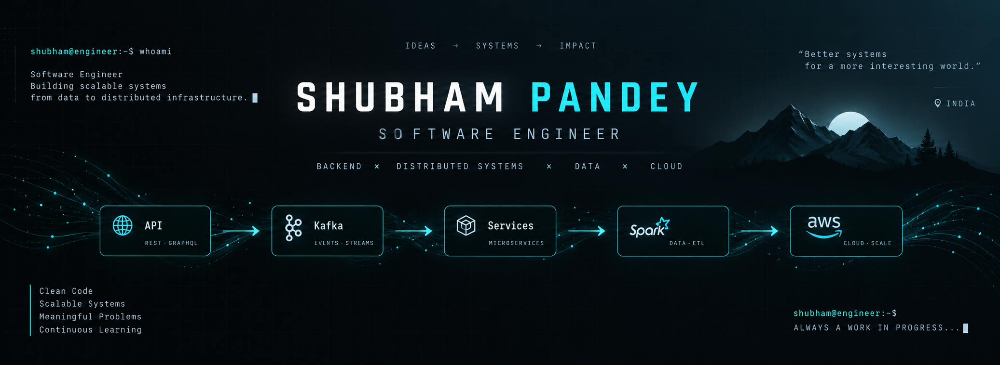

<div align="center">



<br>

[](https://github.com/iamshub03)

</div>

---

## `> whoami`

Software Engineer with **5+ years of experience** building scalable backend systems, microservices, distributed architectures, and cloud-native applications.

My focus sits at the intersection of **backend engineering, distributed systems, data, and cloud infrastructure**.

```text
Backend Engineering       ████████████████████  100%
Distributed Systems       ██████████████████░░   90%
Cloud / Infrastructure    █████████████████░░░   85%
System Design             █████████████████░░░   85%
Data Engineering          ████████████████░░░░   80%
```

---

## `> stack`

<table>
<tr>
<td width="50%" valign="top">

### Languages

`TypeScript` `JavaScript` `Python` `SQL`

### Backend

`Node.js` `NestJS` `Express.js` `Flask`

</td>
<td width="50%" valign="top">

### Data & Messaging

`PostgreSQL` `MySQL` `MongoDB` `Redis`  
`Apache Kafka` `AWS SQS`

### Cloud & Infrastructure

`AWS` `Kubernetes` `Docker` `CI/CD`

</td>
</tr>
<tr>
<td width="50%" valign="top">

### Data & ETL

`Apache Spark` `AWS Glue` `Apache Airflow`

</td>
<td width="50%" valign="top">

### APIs & Architecture

`REST` `GraphQL`  
`Microservices` `Distributed Systems`

</td>
</tr>
</table>

---

## `> what_i_build`

### ⚙️ Distributed Systems

Designing services where **scalability, reliability, concurrency, latency, and failure** are first-class concerns.

### 📡 Event-Driven Systems

Building asynchronous pipelines with **Kafka and SQS**, using events to decouple services and keep systems moving under load.

### 📊 Data Systems

Working with **Spark and AWS Glue** to build and optimize ETL workloads and understand what happens underneath the abstractions.

### ☁️ Cloud-Native Infrastructure

Deploying and operating production systems across **AWS, Kubernetes, Docker, and CI/CD**.

---

## `> engineering_philosophy`

```text
01  Understand the system before optimizing it.
02  Keep abstractions useful, not magical.
03  Design for failure before failure designs for you.
04  Measure performance instead of guessing.
05  Prefer simple systems that scale naturally.
06  Know what happens underneath the abstraction.
```

---

## `> currently_exploring`

```text
Distributed Systems
├── Partitioning & Replication
├── Consistency & Consensus
├── Fault Tolerance
└── Performance

Data Engineering
├── Spark Internals
├── Query Optimization
├── Data Skew
└── Data-intensive Systems

AI Engineering
├── LLMs
├── RAG
├── Agents
└── AI Infrastructure
```

---

## `> outside_the_terminal`

`🎵 Music` &nbsp;&nbsp; `🏃 Running` &nbsp;&nbsp; `🏔️ Mountains`

---

<div align="center">

### `Always a work in progress...`

<br>

[](https://github.com/iamshub03)

</div>
